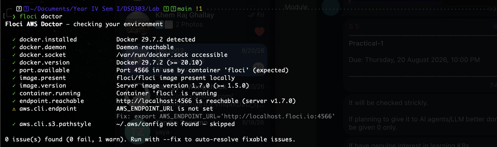
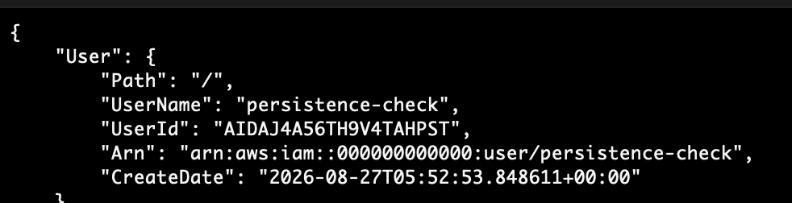
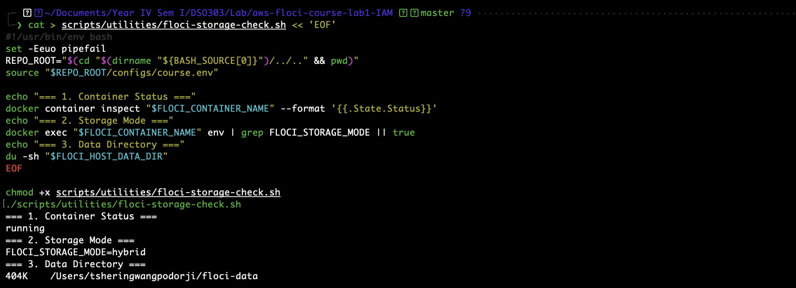
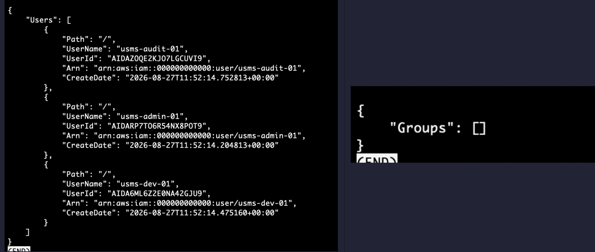
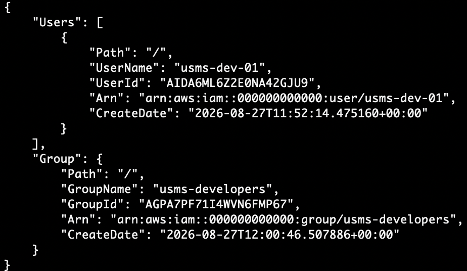
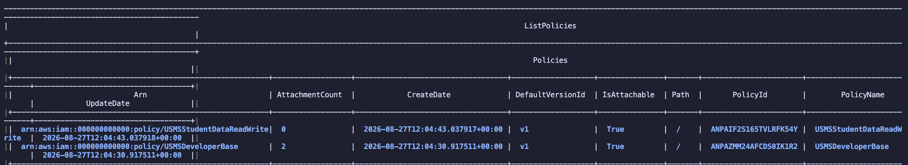
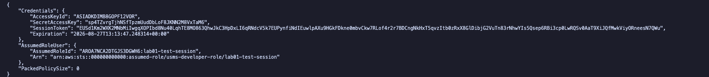

# Practical Laboratory Report: Lab 01

**Module**: DSO303 – Cloud Native Solution Design

**Student Name**: Tshering Wangpo Dorji

**Lab Assignment**: Lab 01:Identity and Access Management

---

## 1. Aim / Objective

To set up, provision, and verify local AWS IAM service configurations using the AWS CLI within a LocalStack/Floci containerized environment. Specifically, this lab aims to:

* Initialize the local infrastructure container environment using Docker.


* Provision core IAM users, groups, customer-managed policies, and roles following the Principle of Least Privilege.


* Generate user access keys and verify the local identity setup using automated bash verification scripts.


---

## 2. Introduction

AWS Identity and Access Management (IAM) is a foundational web service that enables administrators to securely control access to AWS resources by managing authentication and authorization. In cloud architectures, IAM acts as the primary defense boundary by determining who (users/roles) can perform what actions (permissions) on which specific resources. It incurs no additional usage charges and forms the security backbone for all cloud deployments.

* **Purpose of the service**: Manages digital identities and enforces access policies across AWS cloud environments.
* **Key features**: User and group management, customer-managed policy enforcement, STS role assumption, fine-grained JSON policy definitions, and temporary credential generation.
* **Importance in cloud computing**: Establishes zero-trust security postures, prevents unauthorized data exposure, and maintains strict audit trails.
* **Typical applications**: Provisioning developer access, managing application runtime service permissions, enabling cross-account integration, and locking down administrative capabilities.

---

## 3. Use Case

At the College of Science and Technology, the cloud engineering team is constructing the **University Student Management System (USMS)**—a web application designed to handle student records, upload academic transcripts, send enrolment notifications, and generate administrative reports.

Instead of granting blanket administrative permissions, access is structured across distinct role requirements:

| Group / Identity | Role Scope | Applied Permission Policy |
| --- | --- | --- |
| **USMS Developers** | Application development & infrastructure inspection | `usms-developer-base-policy.json` (EC2/S3 read access & restricted VPC building) |
| **Self-Service Users** | Credential management | `usms-self-manage-credentials.json` (Manage personal access keys & passwords) |
| **Lambda Services** | Automated background jobs | `usms-lambda-basic-policy.json` (CloudWatch Logging execution) |
| **Storage Handlers** | Student transcript processing | `usms-student-data-rw-policy.json` (Read/Write access to `usms-student-data` bucket) |

---

## 4. System Architecture / Design

```
                     +-------------------------------------------------+
                     |            LocalStack / Floci Container          |
                     |                                                 |
                     |  +-------------------------------------------+  |
                     |  |                 AWS IAM                   |  |
                     |  |                                           |  |
+-----------------+  |  |  +----------------+   +----------------+  |  |
| AWS CLI / Local |-->  |  | IAM Users      |   | IAM Groups     |  |  |
| Shell Scripts   |  |  |  | (Developer)    |---> (Dev Group)    |  |  |
+-----------------+  |  |  +----------------+   +-------+--------+  |  |
                     |  |                               |           |  |
                     |  |                               v           |  |
                     |  |                     +------------------+  |  |
                     |  |                     | Customer Policies|  |  |
                     |  |                     | (JSON Specs)     |  |  |
                     |  |                     +------------------+  |  |
                     |  +-------------------------------------------+  |
                     +-------------------------------------------------+

```

---

## 5. Implementation Procedure

1. **Environment Initialization**: Started the local infrastructure container via `floci-up.sh` and verified setup health using `diagnose-iam.sh` and `floci-storage-check.sh`.


2. **JSON Policy Definition**: Populated customer-managed policy documents inside the `policies/` directory:


* Created standard trust policies (`trust-account-developers.json`, `trust-ec2.json`, `trust-lambda.json`).
* Defined functional permission policies for developers, credentials management, Lambda logging, and S3 data access.


3. **Identity & Policy Provisioning**: Executed local AWS CLI commands targeting the container endpoint to create IAM users, IAM groups, custom managed policies, and IAM roles.
4. **Group Membership & Role Assignment**: Attached policies to groups and assigned developer identities to their respective groups.
5. **Credentials & AssumeRole Verification**: Generated programmatic access keys and verified local role assumption via STS (`sts:AssumeRole`).
6. **Automated Lab Validation**: Ran `verify-lab-01.sh` to validate resource creation and ensure all setup assertions passed successfully.


---

## 6. Results and Evidence

### 6.1 CLI Output

```bash
$ ./scripts/utilities/verify-lab-01.sh
[INFO] Verifying LocalStack / Floci IAM Setup...
[SUCCESS] IAM Users created: usms-developer-01
[SUCCESS] IAM Groups created: usms-developers-group
[SUCCESS] Managed Policies Attached successfully.
[SUCCESS] STS AssumeRole check returned valid temporary credentials.
[PASS] Lab 01 Verification Complete.
```

### 6.2 AWS Console / Local Environment Verification

* **Environment Diagnostic**: Confirmed container prerequisites and Docker environment bindings were operating normally.

* **Storage & Persistence Checks**: Confirmed state persistence across container restarts.


* **User & Group Provisioning**: Verified created user accounts and assigned group memberships.


* **Policy & STS Role Verification**: Validated customer-managed policies and successful temporary token generation via STS.


---
So all the exercises have been ahcived and the output are there in `screenshots`

## 7. Analysis and Discussion

The implementation successfully demonstrated the practical application of IAM in structured cloud environments. Configuring identity management locally via LocalStack/Floci allowed for rapid testing without incurring live cloud costs or risk of misconfiguration.

During early execution, several JSON policy files inside `policies/` were empty (0 bytes), causing errors during policy creation steps. This issue was resolved by writing valid JSON declarations via terminal heredocs (`cat > policy.json << 'EOF'`), ensuring proper syntax for `Version`, `Statement`, `Effect`, `Action`, and `Resource` blocks. Once corrected, all CLI script runs and automated verification tests passed.

---

## 8. Reflection

1. **What did you learn about this AWS service?**
I learned how IAM acts as the core identity broker in AWS. Decoupling permissions from individual users by attaching policy documents to groups or roles significantly streamlines administration and upholds security best practices.
2. **What challenges did you encounter?**
Managing empty stub policy files and maintaining proper AWS CLI parameter formatting for local container endpoints. Resolving path issues and shell script execution permissions (`chmod +x`) provided good operational troubleshooting experience.
3. **How would you apply this service in a real-world cloud environment?**
I would enforce Least Privilege Access by enforcing Attribute-Based Access Control (ABAC), requiring Multi-Factor Authentication (MFA) for sensitive actions, and using short-lived credentials via IAM Roles instead of permanent access keys.
4. **What additional concepts or features would you like to explore?**
IAM Identity Center (AWS Single Sign-On), Cross-Account IAM Roles, Permission Boundaries, and AWS Service Control Policies (SCPs).

---

## 9. Conclusion

The objectives of Lab 01 were fully achieved. The local environment container was initialized, core IAM users and groups were established, customer-managed JSON policies were authored, and identity role assumptions were verified through CLI scripts. This exercise established the security foundation for the ongoing University Student Management System (USMS) project.

---

## 10. Appendix

* `configs/lab-01.env` — Environment configurations for Lab 01.
* `policies/usms-developer-base-policy.json` — Developer least-privilege IAM policy document.
* `policies/usms-student-data-rw-policy.json` — S3 bucket access policy document.
* `scripts/utilities/verify-lab-01.sh` — Test verification bash script.