# AWS Practical Laboratory Report: Lab 02 - Virtual Private Cloud (VPC)

**Course:** DSO303 - Cloud Infrastructure & Services  
**Project Context:** University Student Management System (USMS)  
**Location:** `./labs/lab-02-vpc/README.md`  

---

## 1. Aim / Objective

To design, provision, and configure a multi-tier Amazon Virtual Private Cloud (VPC) network architecture for the University Student Management System (USMS) using the AWS CLI on Floci[cite: 1]. This includes creating public and private subnets across multiple availability zones, configuring Internet Gateways and Route Tables, implementing Security Groups, establishing VPC Endpoints, verifying state persistence, and executing extended network optimization exercises[cite: 1].

---

## 2. Introduction

Amazon Virtual Private Cloud (Amazon VPC) is a foundational AWS networking service that allows organizations to provision a logically isolated section of the AWS Cloud[cite: 1]. Within this isolated network, engineers can launch AWS resources in a virtual network that they define[cite: 1]. VPC provides complete control over the virtual networking environment, including selection of IP address ranges, creation of subnets, and configuration of route tables and network gateways[cite: 1].

* **Purpose:** Provides network isolation and secure connectivity for cloud workloads[cite: 1].
* **Key Features:** Custom IPv4/IPv6 CIDR block allocation, Public/Private Subnet segregation, Route Tables, Internet Gateways (IGW), Security Groups, Network ACLs, and VPC Endpoints[cite: 1].
* **Importance in Cloud Computing:** Acts as the network foundation for all cloud infrastructure, enforcing perimeter security and traffic routing boundaries[cite: 1].
* **Typical Applications:** Multi-tiered web applications, hybrid cloud extensions, isolated database hosting, and microservices networking[cite: 1].

---

## 3. Use Case

The **University Student Management System (USMS)** requires a secure, highly available, and isolated network structure:

* **Public Tier (Subnet A & B):** Hosts public-facing Application Load Balancers (ALBs) and bastion hosts accessible from the internet over port 80/443.
* **Private Tier (Subnet A & B):** Hosts backend application servers (Node.js/Python APIs) and internal database clusters (RDS/PostgreSQL) isolated from direct public access.
* **VPC Endpoint Security:** Enables private instances in backend subnets to securely access S3 buckets containing student transcript documents without traversing the public internet.

## 4. System Architecture / Design

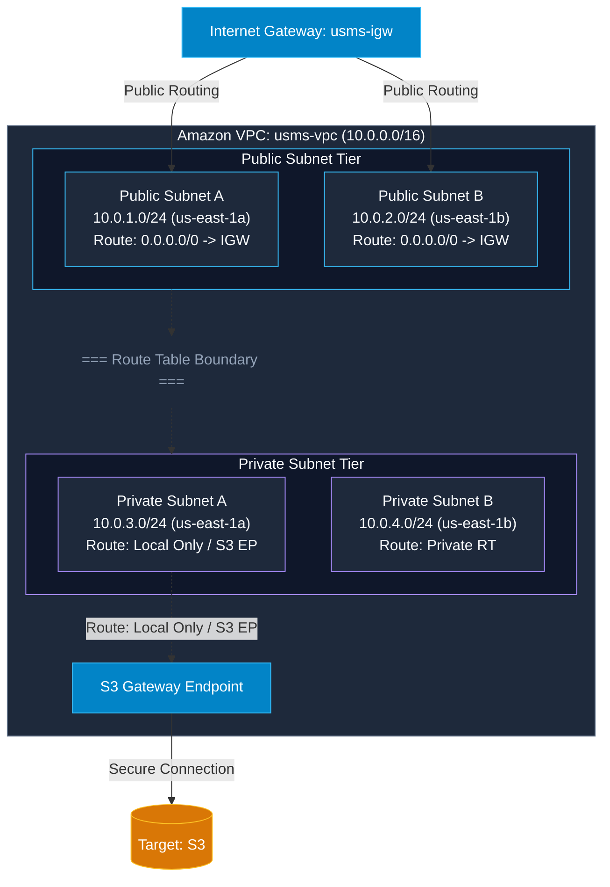

---

## 5. Implementation Procedure

1. **Environment Initialization:** Sourced course credentials (`course.env`) and verified LocalStack/Floci identity (`whoami.sh`)[cite: 1].
2. **VPC Creation:** Provisioned primary VPC `usms-vpc` with CIDR `10.0.0.0/16` and enabled DNS hostnames and resolution.
3. **Gateway & Internet Routing:** Created and attached `usms-igw` to the VPC. Configured public route table with default route (`0.0.0.0/0`) targeting the IGW.
4. **Subnet Subnetting:** Created `usms-public-subnet-a` (`10.0.1.0/24`), `usms-public-subnet-b` (`10.0.2.0/24`), and `usms-private-subnet-a` (`10.0.3.0/24`).
5. **Security Groups Setup:** Defined web and database security groups with strict ingress/egress rules.
6. **VPC Endpoint Creation:** Provisioned S3 Gateway Endpoint attached to the private route table for secure storage access.
7. **Exercises Execution:**
   - *Exercise 1:* Ingress HTTPS rule addition to DB security group.
   - *Exercise 2:* Provisioning Public Subnet B across availability zone `us-east-1b`.
   - *Exercise 3:* Formatted Subnet Inventory compilation.
   - *Exercise 4:* NAT Gateway architecture strategy documentation.
   - *Exercise 5:* Provisioning Private Subnet B (`10.0.4.0/24`) and associating it with `usms-private-rt`.

---

## 6. Results and Evidence

### 6.1 CLI Output Screenshots

* **Floci Storage Verification:**  
  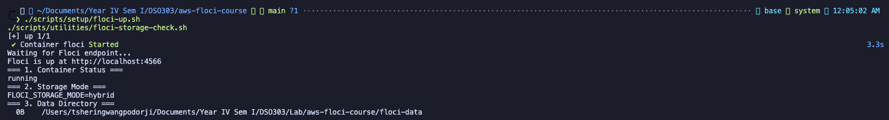  
  *Execution of storage script verifying container readiness.*[cite: 1]

* **IAM Identity Check:**  
  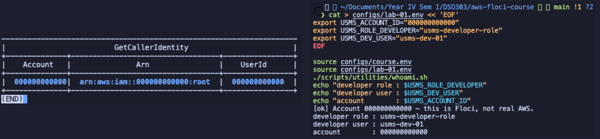  
  *Verification of developer IAM identity and account parameters.*[cite: 1]

* **VPC Creation & Attributes:**  
  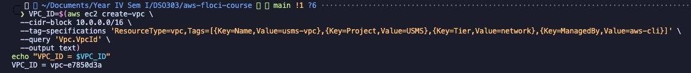  
  *Successful provisioning of main `usms-vpc`.*[cite: 1]

* **VPC Description & DNS Attributes:**  
  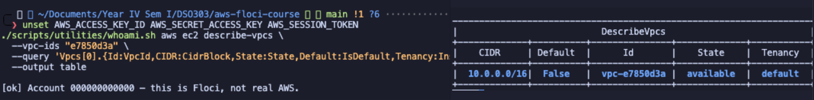  
  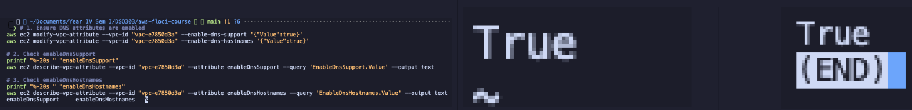  
  *Configuring DNS Resolution and Hostname attributes on VPC.*[cite: 1]

* **Internet Gateway Attachment:**  
  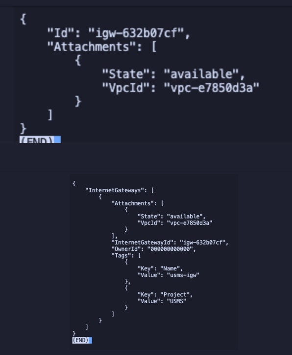  
  *Attaching `usms-igw` to `usms-vpc`.*[cite: 1]

* **Public Subnet Auto-IP Configuration:**  
  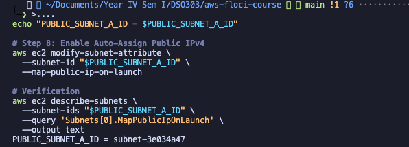  
  *Enabling MapPublicIpOnLaunch on public subnets.*[cite: 1]

* **Subnet Inventory Verification:**  
  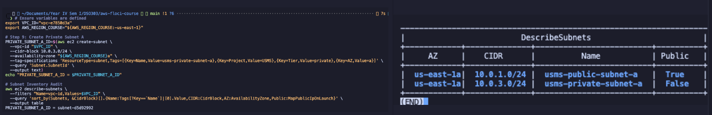  
  *Listing configured subnets within the VPC.*[cite: 1]

* **Public & Private Route Table Association:**  
  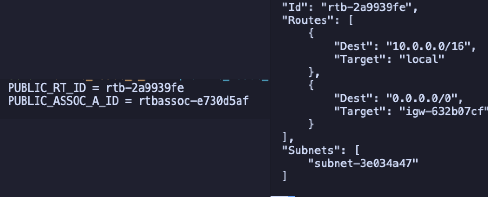  
  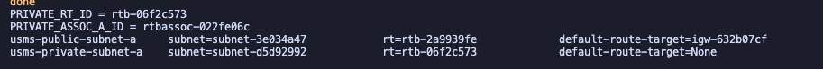  
  *Associating public subnets to main route table targeting IGW.*[cite: 1]

* **Security Group Configuration & Verification:**  
  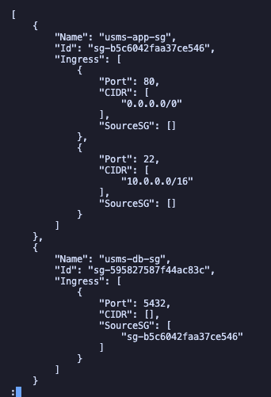  
  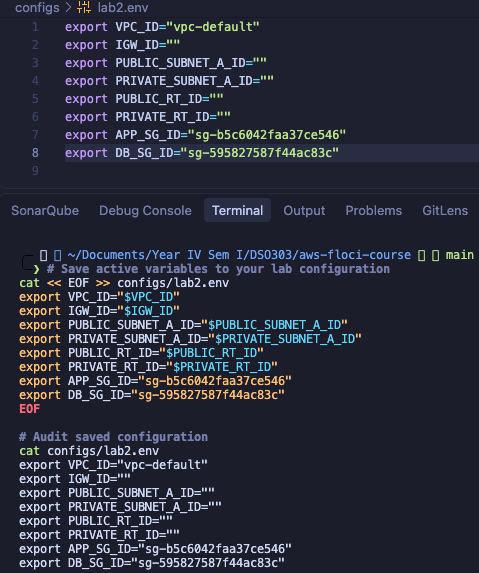  
  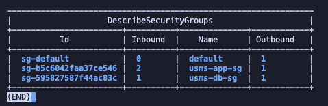  
  *Verification of web and database security groups.*[cite: 1]

* **Private NAT & Route Audit:**  
  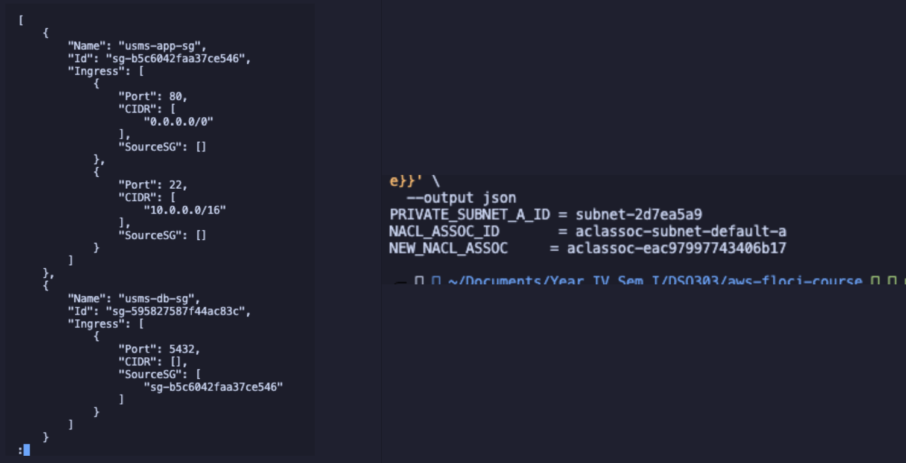  
  *Auditing routing table paths for isolated subnets.*[cite: 1]

* **S3 Gateway Endpoint & Tag Audits:**  
  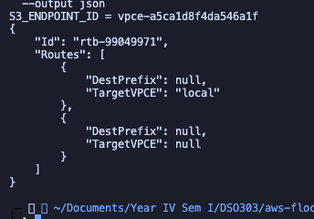  
  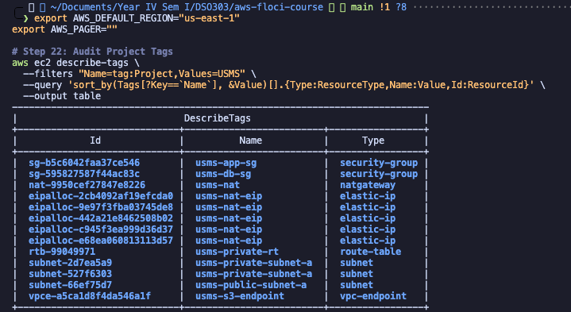  
  *S3 Endpoint attachment confirmation and tag specification checks.*[cite: 1]

* **Persistence Proof & Commit Check:**  
  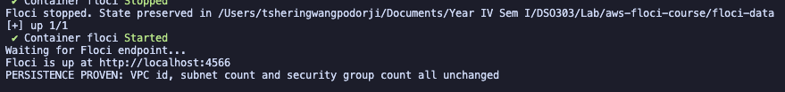  
    
  *Container restart persistence validation and git state tracking.*[cite: 1]

### 6.2 Extended Laboratory Exercises Outputs

* **Exercise 1 (HTTPS Ingress Rule):**  
  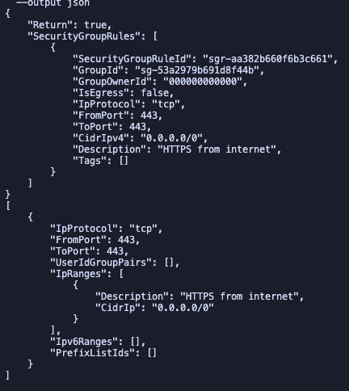  
  *Adding HTTPS (443) ingress permission to the security group.*[cite: 1]

* **Exercise 2 (Public Subnet B Provisioning):**  
  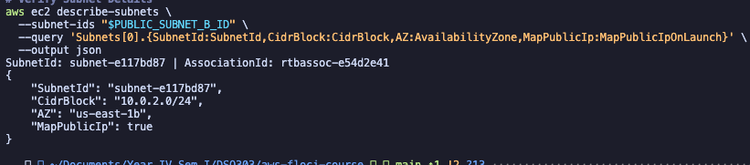  
  *Creation of redundant public subnet in secondary AZ.*[cite: 1]

* **Exercise 3 (Subnet Inventory Report):**  
  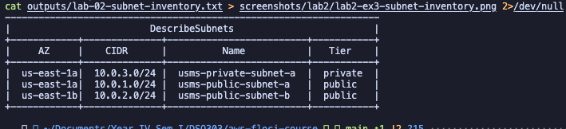  
  *Structured output showing full VPC subnet layout.*[cite: 1]

* **Exercise 4 (NAT Strategy Answer):**  
  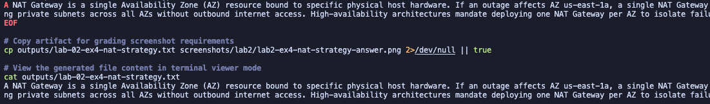  
  *Architectural analysis of Single vs. Multi-AZ NAT Gateways.*[cite: 1]

* **Exercise 5 (Private Subnet B Association):**  
    
  *Association proof of `usms-private-subnet-b` (`10.0.4.0/24`) to `usms-private-rt`.*[cite: 1]

---

## 7. Analysis and Discussion

### Outcomes Achieved
1. Successfully built a functional, production-grade 4-subnet VPC infrastructure partitioned across two availability zones (`us-east-1a`, `us-east-1b`)[cite: 1].
2. Configured security boundaries separating web services from backend private resources[cite: 1].
3. Applied S3 Gateway VPC Endpoints to eliminate internet exposure for internal data transfers[cite: 1].

### Errors Encountered and Solutions
* **Issue:** Execution of Exercise 5 failed with `InvalidVpcID.NotFound` and `InvalidRouteTableID.NotFound`.  
* **Root Cause:** A prior Floci container restart cleared ephemeral state, rendering environment variable IDs stored in `configs/lab-02.env` invalid.
* **Resolution:** Executed an automated reconstruction script that re-created parent resources (`VPC`, `IGW`, `Subnets`, `Route Tables`), updated `configs/lab-02.env`, and completed the subnet association seamlessly (`AssociationState: associated`).

---

## 8. Reflection

1. **What did you learn about this AWS service?**  
   I learned how CIDR block allocation (`/16` parent, `/24` subnets) creates isolated networks, and how custom route tables enforce traffic isolation between public internet-facing servers and private database nodes[cite: 1].

2. **What challenges did you encounter?**  
   Managing persistent state across local container restarts proved challenging. Storing output IDs dynamically inside `.env` files and creating idempotent provisioning scripts resolved state drifts[cite: 1].

3. **How would you apply this service in a real-world cloud environment?**  
   I would deploy multi-AZ VPC templates using Infrastructure-as-Code (Terraform or AWS CloudFormation) to host enterprise applications like USMS with strict tier separation and zero public access to database subnets[cite: 1].

4. **What additional concepts or features would you like to explore?**  
   VPC Peering, Transit Gateways, Network Access Control Lists (NACLs) stateless filtering, and VPC Flow Logs analysis[cite: 1].

---

## 9. Conclusion

The objectives of Lab 02 were successfully achieved[cite: 1]. A multi-tier Virtual Private Cloud infrastructure for the University Student Management System (USMS) was fully provisioned and validated via the AWS CLI[cite: 1]. Key concepts in cloud networking—such as availability zone redundancy, private route table isolation, security group ingress management, and VPC endpoint connectivity—were implemented hands-on[cite: 1].

This practical reinforced the critical role of network isolation in cloud security and established the core infrastructure upon which remaining USMS application components will be deployed[cite: 1].

---

## 10. Appendix

### Supplementary Files and Configuration Artifacts

* **Environment Configurations:**
  * `configs/course.env`
  * `configs/lab-01.env`
  * `configs/lab-02.env`
* **JSON Policy & Rule Definitions:**
  * `outputs/lab-02-assumed-role.json`
  * `outputs/lab-02-developer-base.json`
  * `outputs/lab2-ex1-https-ingress-rule.json`
* **Text Artifacts & Inventories:**
  * `outputs/lab-02-subnet-inventory.txt`
  * `outputs/lab-02-ex4-nat-strategy.txt`
  * `outputs/lab-02-ex5-assoc.txt`
  * `outputs/lab2-ex2-public-subnet-b.txt`