# AWS Practical Laboratory Report: Lab 03 - Amazon EC2 and Deploying the USMS Application

**Course:** DSO303 - Cloud Infrastructure & Services  
**Project Context:** University Student Management System (USMS)  
**Location:** `./labs/lab-03-ec2/README.md`  

---

## 1. Aim / Objective

To deploy the USMS application as a two-tier EC2 architecture inside the Lab 02 VPC, using the
AWS CLI against the Floci emulator. The lab combines artefacts from earlier labs (Lab 01's instance
profile, Lab 02's subnets and security groups) with new ones: a key pair, a user-data bootstrap
script, an Elastic IP, an EBS data volume and a golden AMI.

The aim is not only to create these resources but to **prove** each important property instead of
trusting that a command succeeded:

* the instance's IAM permission chain,
* the delivery of the user-data script,
* the wiring between the web tier and the data tier,
* the behaviour of an Elastic IP across stop/start,
* the persistence of everything across an emulator restart.

---

## 2. Introduction

Amazon Elastic Compute Cloud (EC2) provides resizable virtual servers in the AWS Cloud. A running
instance is the combination of three things:

* **AMI (Amazon Machine Image):** a regional, immutable template for the root disk plus metadata
  (architecture, virtualisation type, block devices).
* **Instance type:** the hardware shape. `t3.micro` is 2 vCPUs and 1 GiB of memory, with burstable CPU.
* **User data:** a script passed to the instance at launch that cloud-init runs **once, as root, at
  first boot**. It is limited to 16 KB.

The supporting resources used in this lab are:

| Resource | Purpose |
|---|---|
| **Key pair** | SSH access. AWS keeps the public half; the private key is shown exactly once. |
| **Instance profile** | Wraps an IAM role so the instance gets temporary credentials, with no keys on disk. |
| **Elastic IP** | A public IPv4 address owned by the account, independent of any instance. |
| **EBS volume** | Block storage with its own lifecycle, bound to one Availability Zone. |
| **Custom AMI** | A captured, already-configured machine, so new launches are copies, not rebuilds. |

---

## 3. Use Case

The USMS student portal must run inside the network built in Lab 02:

* **Web tier, `usms-web-01`:** in `usms-public-subnet-a`, serving the portal on port 80, reachable
  at a stable Elastic IP, protected by `usms-app-sg`, and carrying `usms-ec2-app-profile` so that it
  can write student transcripts to S3 in Lab 04 without any access keys on the machine.
* **Data tier, `usms-db-01`:** in `usms-private-subnet-a`, with no public address and no IAM role,
  accepting PostgreSQL (5432) only from the web tier's security group, with outbound access only
  through the NAT gateway.
* **Durable storage:** student data lives on a separate EBS volume that survives instance termination.
* **Repeatability:** a golden AMI captures the configured web server for Lab 08's Auto Scaling group.

---

## 4. Architecture

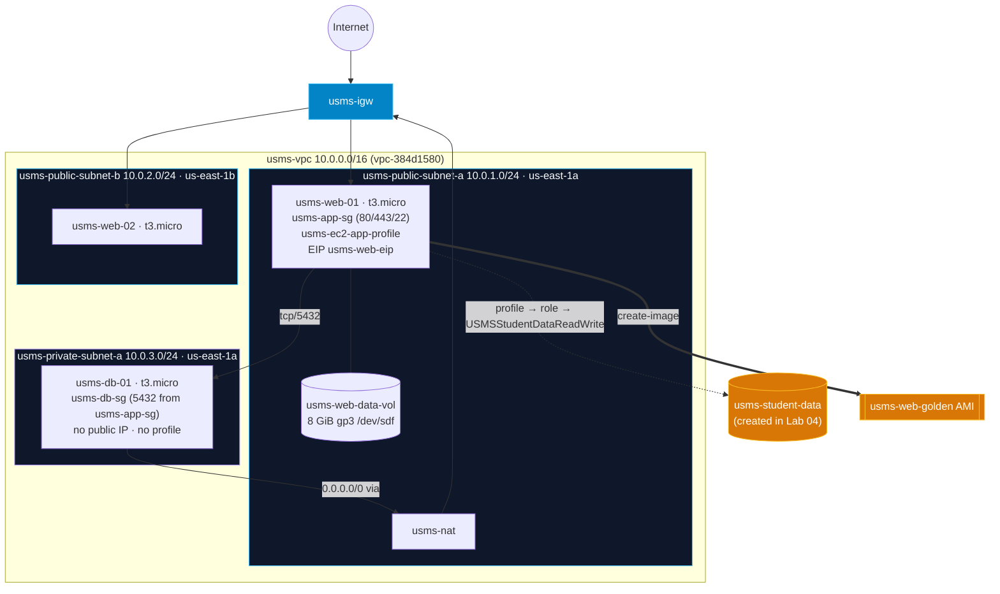

### Resources created

| Resource | ID | Notes |
|---|---|---|
| `usms-app-key` | key pair | private key `outputs/usms-app-key.pem`, chmod 600, git-ignored |
| `usms-web-01` | `i-4314867a781a3244a` | public subnet A, `usms-app-sg`, `usms-ec2-app-profile` |
| `usms-web-eip` | `eipalloc-003bc71541a17f519` | associated with `usms-web-01` |
| `usms-web-data-vol` | `vol-f37f7ddc60bacddb0` | 8 GiB gp3, DeleteOnTermination False |
| `usms-db-01` | `i-9a38e8fae9dd2a3e4` | private subnet A, `usms-db-sg`, no public IP, no profile |
| `usms-web-02` | `i-72e3cbbe2ec42a154` | public subnet B, us-east-1b (Step 18 "Your turn") |
| `usms-web-golden` | `ami-03c22837ff109efbf` | created from `usms-web-01` with `--no-reboot` |
| `usms-db-02` | `i-a878dbc918f88fd52` | private subnet B (Exercise 2) |

---

## 5. Implementation Procedure

1. **Environment check (Steps 1-2):** started Floci, sourced `course.env`, `lab-01.env` and `lab-02.env`, ran `verify-lab-02.sh`.
2. **Lab 02 repair (pre-requisite):** consolidated the network into one VPC with `scripts/utilities/repair-lab-02-network.sh` (see Section 7).
3. **AMI selection (Step 3):** resolved Amazon Linux 2023 from the SSM public parameter instead of hard-coding an ID.
4. **Key pair (Steps 4-5):** created `usms-app-key`, stored the private key safely, and proved it is git-ignored.
5. **User data (Step 6):** wrote `labs/lab-03-ec2/user-data.sh`.
6. **Request template (Step 7):** wrote `templates/lab-03-run-instances.json` from the CLI skeleton.
7. **Launch, wait, read back (Steps 8-10):** launched `usms-web-01` and waited with `aws ec2 wait`.
8. **Permission chain and user data (Steps 11-12).**
9. **Elastic IP and reachability (Steps 13-14).**
10. **Data volume (Step 15).**
11. **Data tier and wiring (Steps 16-17).**
12. **Stop/start and second web server (Step 18).**
13. **Persistence (Step 19).**
14. **Golden AMI, audit, env file (Steps 20-22).**
15. **Verification and cleanup scripts (Section 9).** The cleanup script was written and syntax-checked but **not run**.
16. **Exercises 1-5 (Section 13).**

Each step is described in detail, with its evidence, in Section 6.

---

## 6. Results and Evidence

All commands were run from the repository root after:

```bash
source configs/course.env; source configs/lab-01.env; source configs/lab-02.env; source configs/lab-03.env
```

### 6.1 Main Lab Steps

---

#### 6.1.1 Confirm the Lab 02 network is intact (Step 2)

**Task:** Before building on the network, check that Lab 02's VPC, subnets, routing and security
groups still exist and are correct.

**Why it matters:** Lab 03 launches instances *into* this network. If the internet gateway, route
tables or security groups are wrong, the instances still launch successfully, but they are
unreachable, and nothing in Lab 03 would explain why.

**Command:** `./scripts/utilities/verify-lab-02.sh`

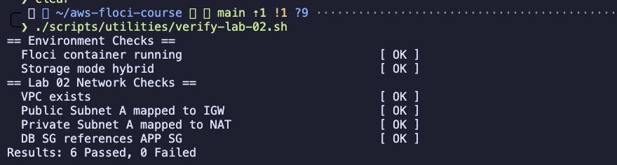

**Observation:** All checks pass (`0 Failed`). This result comes *after* the Lab 02 repair
described in Section 7. The first run also passed, but the network behind it was split across three
VPCs. That showed the original script only checked that resources existed, not how they related.

---

#### 6.1.2 Create the key pair and prove the private key is git-ignored (Steps 4-5)

**Task:** Create the EC2 key pair `usms-app-key`, write the private key straight to a file, lock
down its permissions, and prove Git will never commit it.

**Why it matters:**
* The private key is shown only once and can never be retrieved again.
* Redirecting it straight to a file keeps it out of the terminal scrollback and out of screenshots.
* SSH refuses a private key that other users can read, so `chmod 600` is required.
* A committed private key is a permanent leak, even if deleted later.

**Command:** `ls -l outputs/usms-app-key.pem; git check-ignore -v outputs/usms-app-key.pem`

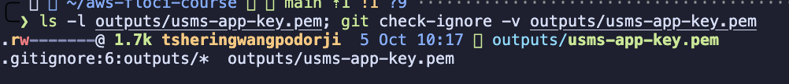

**Observation:**
* Permissions are `-rw-------` (600).
* `git check-ignore -v` names the rule that matches: `.gitignore:6:outputs/*`.
* The repository had no `.gitignore` when this lab started, so one was created *before* the key existed.

---

#### 6.1.3 Write and check the user-data bootstrap script (Step 6)

**Task:** Write `labs/lab-03-ec2/user-data.sh`. At first boot it installs nginx, asks the Instance
Metadata Service (IMDSv2) for the instance ID, AZ and private IP, and writes the portal page
`index.html` plus a machine-readable `health.json`.

**Why it matters:**
* The instance must configure itself without anyone logging in.
* A syntax error in user data fails silently at boot, on a machine you may not be able to reach,
  so the syntax is checked locally first.
* The outer heredoc is quoted (`<< 'EOF'`) so `$(date)` and `${INSTANCE_ID}` are expanded on the
  instance at boot, not on the laptop when the file is written.

**Command:** `bash -n labs/lab-03-ec2/user-data.sh && echo "syntax OK"; wc -c labs/lab-03-ec2/user-data.sh`

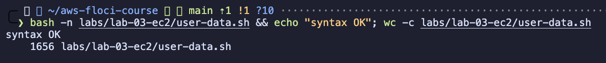

**Observation:** `syntax OK`, and the script is 1,656 bytes, well under the 16,384-byte user-data limit.

---

#### 6.1.4 Launch the USMS web server (Steps 7-10)

**Task:** Write the `run-instances` request as a reviewable JSON template, launch `usms-web-01`
with it, wait for `running`, and read back the important fields.

**Why it matters:** This single call combines artefacts from three labs: the subnet and security
group (Lab 02), the instance profile (Lab 01), and the key pair and user data (Lab 03).

* **Template (`--generate-cli-skeleton` / `--cli-input-json`):** the request is a reviewable, diffable file instead of a long command line.
* **Waiter (`aws ec2 wait instance-running`):** polls the real state instead of guessing with `sleep`.

**Command:** `cat outputs/lab-03-step10-web.txt` (saved output of the Step 10 `describe-instances` query)

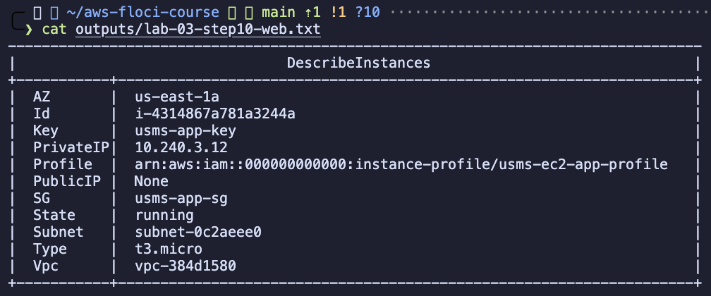

**Observation:**

| Field | Value | Meaning |
|---|---|---|
| State | `running` | the launch succeeded |
| Subnet | `subnet-0c2aeee0` (`usms-public-subnet-a`) | placed in the right subnet |
| SG | `usms-app-sg` | not the `default` group |
| Key | `usms-app-key` | login path attached |
| Profile | `arn:...:instance-profile/usms-ec2-app-profile` | the IAM identity is attached |
| AZ | `us-east-1a` | matches the subnet |

**Floci note:** the private IP comes from Floci's Docker network (`10.240.x.x`), not from the
subnet's `10.0.1.0/24`, because Floci runs each instance as a container.

---

#### 6.1.5 Trace the permission chain from instance to policy (Step 11)

**Task:** Follow the IAM chain link by link: instance → instance profile → role → attached policy → policy document.

**Why it matters:** The instance profile is the reason the web server needs **no AWS credentials on
disk**. Tracing the chain now explains, before Lab 04, exactly why the instance will be able to write
to S3.

**Command:** `cat outputs/lab-03-step11-permission-chain.txt`

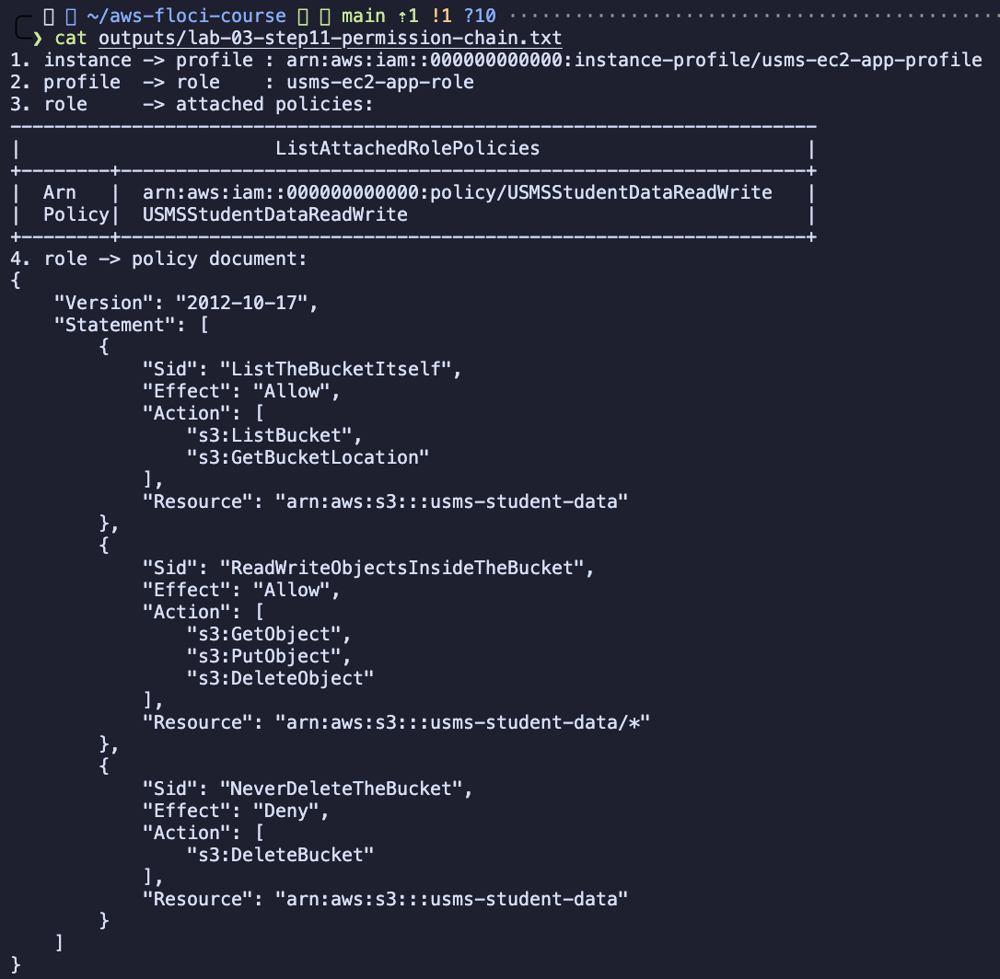

**Observation:**
* The chain resolves fully: `usms-ec2-app-profile` → `usms-ec2-app-role` → `USMSStudentDataReadWrite`.
* The policy allows `ListBucket`, `GetObject`, `PutObject` and `DeleteObject` on
  `arn:aws:s3:::usms-student-data`, and explicitly **denies** `DeleteBucket`.

**Key point:** that bucket does not exist yet. This is valid, not broken: an IAM policy is a
statement about ARNs, not a reference to objects. The permission takes effect the moment Lab 04
creates the bucket.

---

#### 6.1.6 Checkpoint 3: prove the user data arrived (Step 12)

**Task:** Read the user data back from EC2, decode it with `openssl base64 -d -A`, and `diff` it
against the local file to prove it is byte-identical.

**Why it matters:** `run-instances` accepting the script is not proof that EC2 stored what was
intended. A round-trip `diff` proves the encoding, storage and decoding were all lossless.

**Command:**
```bash
aws ec2 describe-instance-attribute --instance-id $USMS_WEB_INSTANCE --attribute userData --output json
docker logs floci 2>&1 | grep "UserData.*$USMS_WEB_INSTANCE" | cut -c1-160
```

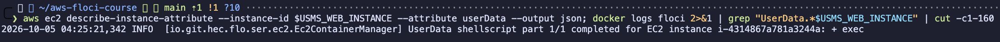

**Observation (Floci limitation):**
* `describe-instance-attribute` returns only the `InstanceId`. This Floci build does not return
  the `userData` attribute, so the byte-identical `diff` cannot pass here.
* Floci's own log shows `UserData shellscript part 1/1 completed` for this instance, so the script
  **was delivered and executed**.
* Inside the instance, nginx was installed and `health.json` contained the real instance ID and AZ.

**On real AWS:** the attribute returns the base64 script and the `diff` produces no output.

---

#### 6.1.7 Give the web server a stable public address (Step 13)

**Task:** Allocate the Elastic IP `usms-web-eip` and associate it with `usms-web-01`.

**Why it matters:** An auto-assigned public IP belongs to the instance only while it is running and
changes after every stop/start. A student portal's DNS record needs an address that never changes.

* An **allocation ID** is the handle for the address itself.
* An **association ID** is the handle for the link between the address and the instance.

**Command:** `cat outputs/lab-03-step13-eip.txt`

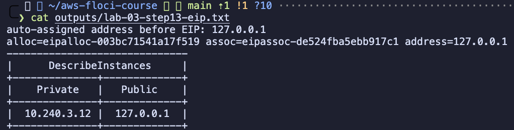

**Observation:**
* The output shows both an allocation ID (`eipalloc-...`) and an association ID (`eipassoc-...`).
* The instance's public address now comes from the EIP.

**Floci note:** Floci reports every public address as `127.0.0.1` (its host loopback), so the
address is not routable. **On real AWS:** an unassociated Elastic IP is billed, and since February
2024 every public IPv4 address is billed.

---

#### 6.1.8 Test reachability: the six-link chain (Step 14)

**Task:** Try `curl` against the public address. When there is no answer, prove each of the six
configuration links that must hold for a browser to reach the instance.

**Why it matters:** This is the standard procedure for diagnosing "I cannot reach my instance" on real AWS.

| # | Link checked | Expected result |
|---|---|---|
| 1 | Instance state | `running` |
| 2 | Subnet's route table | default route to an internet gateway |
| 3 | Internet gateway | attached to the VPC |
| 4 | Security group | allows TCP 80 from `0.0.0.0/0` |
| 5 | Instance | has a public address |
| 6 | Network ACL on the subnet | allows the traffic |
| 7 | *A process listening on port 80* | *cannot be checked with the API* |

**Command:** `cat outputs/lab-03-step14-reachability.txt`

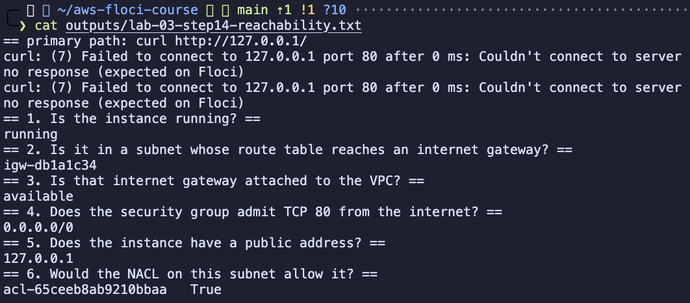

**Observation:**
* `curl` gets no response.
* All six configuration links pass: `running`, `igw-db1a1c34`, `available`, `0.0.0.0/0`,
  `127.0.0.1`, default NACL.
* The missing link is #7. nginx was installed by user data, but it cannot bind port 80 inside the
  Floci container, because Floci's metadata proxy already holds `169.254.169.254:80`.
* Before the Lab 02 repair, links 2 and 4 would have **failed**. The internet gateway was in another
  VPC, and the security group had no port-80 rule.

---

#### 6.1.9 Create and attach a data volume (Step 15)

**Task:** Create an 8 GiB `gp3` EBS volume, `usms-web-data-vol`, in the same AZ as the instance (read
from the instance, not typed by hand) and attach it as `/dev/sdf`.

**Why it matters:**
* The root volume is deleted when the instance is terminated, so student records cannot live there.
* A separate volume has its own lifecycle and survives termination.
* `gp3` gives a baseline 3,000 IOPS regardless of size.

**Command:** `cat outputs/lab-03-step15-volume.txt`

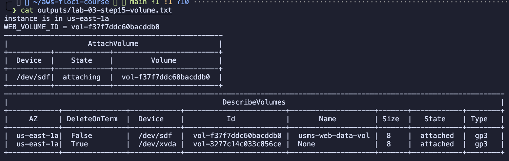

**Observation:** Two volumes are attached to `usms-web-01`:

| Device | Volume | DeleteOnTermination | Meaning |
|---|---|---|---|
| `/dev/xvda` | root, created from the AMI | **True** | deleted with the instance |
| `/dev/sdf` | `usms-web-data-vol` | **False** | survives termination |

That single column is the difference between temporary storage and durable storage.

---

#### 6.1.10 Test the Availability Zone constraint (Step 15, "Your turn")

**Task:** Create a test volume in `us-east-1b` and try to attach it to `usms-web-01`, which is in
`us-east-1a`. Then delete the test volume.

**Why it matters:** An EBS volume lives in one AZ's storage and cannot be attached across AZs. The
rule is tested here rather than taken on trust. Moving data between AZs requires a snapshot,
which is regional.

**Command:** `cat outputs/lab-03-step15-az-test.txt`

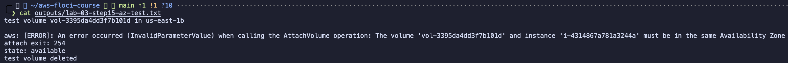

**Observation:**
* Floci **enforced** the rule: `The volume ... and instance ... must be in the same Availability Zone` (`InvalidParameterValue`).
* The volume stayed `available`, and it was then deleted.
* **On real AWS** the error code is `InvalidVolume.ZoneMismatch`.

---

#### 6.1.11 Launch the database-tier instance (Step 16)

**Task:** Launch `usms-db-01` into `usms-private-subnet-a` with `usms-db-sg`, using the long-form
command line, and deliberately **without** an instance profile.

**Why it matters:** Two instances in different subnets with different security groups turn the
design into a real two-tier architecture. The database has no reason to call S3. Giving it an IAM role
anyway would be unnecessary privilege, which is exactly the kind of drift that least privilege guards against.

**Command:** `cat outputs/lab-03-step16-db.txt`

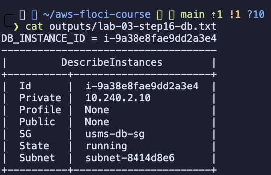

**Observation:**
* State `running`, subnet `subnet-8414d8e6` (`usms-private-subnet-a`), SG `usms-db-sg`.
* **Public `None`:** the private subnet does not auto-assign public addresses.
* **Profile `None`:** on purpose.

---

#### 6.1.12 Checkpoint 5: prove the two tiers are wired correctly (Step 17)

**Task:** Read back the configuration that would block internet traffic to the database tier and
allow only the web tier to reach it, and prove it is correct.

**Why it matters:** Floci does not enforce security groups on traffic, so a refused connection
cannot be demonstrated. The honest proof is to read back the exact configuration that produces
that behaviour on real AWS.

**Command:** `cat outputs/lab-03-step17-wiring.txt`

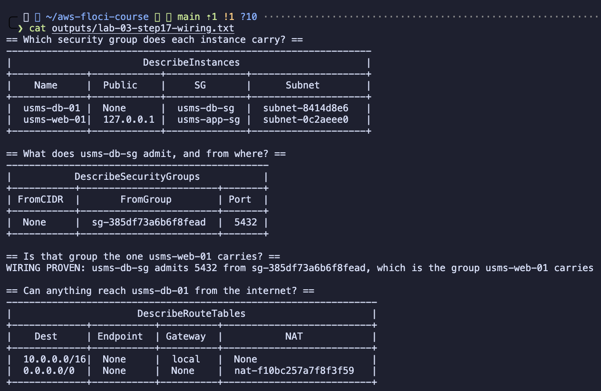

**Observation:**
1. `usms-web-01` carries `usms-app-sg` and has a public address; `usms-db-01` carries `usms-db-sg` and has none.
2. `usms-db-sg` admits port **5432** only from a **security group** (`sg-385df73a6b6f8fead`), with no CIDR rule.
   Referencing a group keeps working if the web tier's IPs change or it scales out.
3. **`WIRING PROVEN`:** that source group is exactly the one `usms-web-01` carries.
4. The private route table has `10.0.0.0/16 → local` and `0.0.0.0/0 → nat-...`, with **no internet
   gateway**. Traffic can go out but not come in, so the database is unreachable from the internet
   by routing. That would hold even if someone opened its security group to the world.

---

#### 6.1.13 Stop and start the web server (Step 18)

**Task:** Stop `usms-web-01`, inspect it while stopped, start it again, and compare the public
address, the private address and the Elastic IP association.

**Why it matters:** This tests the Step 13 claim instead of trusting it. `stop-instances` is
reversible; `terminate-instances` would not be, and Lab 04 needs this instance.

**Command:** `cat outputs/lab-03-step18-stop-start.txt`

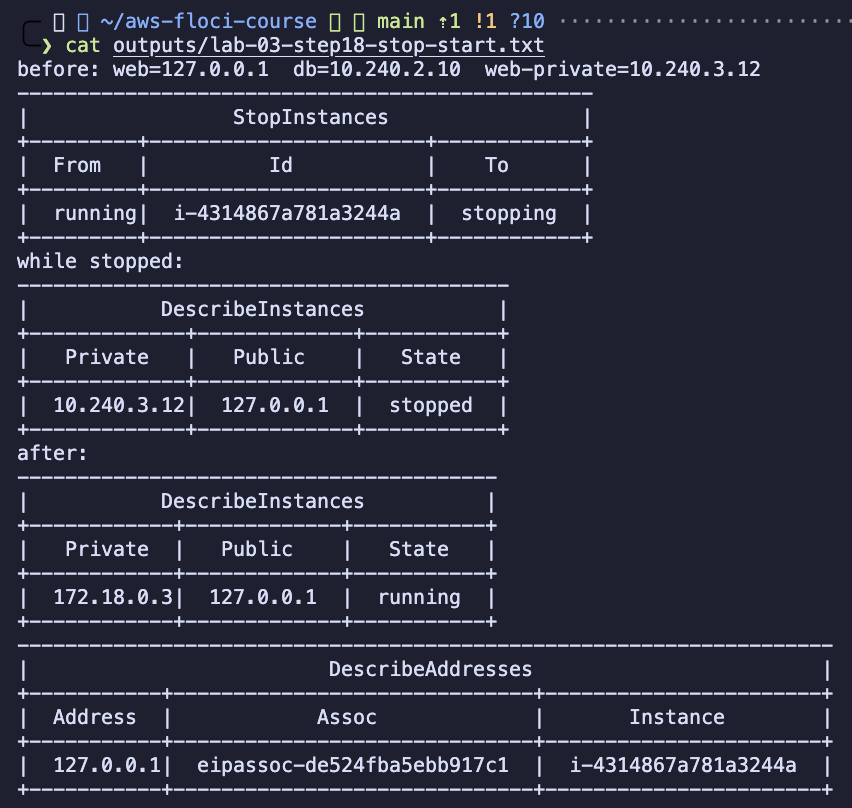

**Observation:**
* The Elastic IP stayed associated with the same instance through the whole cycle.
* **Floci limitation:** the public field still showed `127.0.0.1` while stopped. Real AWS shows no
  public address at all for a stopped instance.
* **Floci difference:** the private IP **changed** (`10.240.3.12` → `172.18.0.3`), because Floci
  re-created the container on another Docker network.

**On real AWS:**
* An auto-assigned public IP is released on stop.
* An Elastic IP is kept.
* The private IP never changes for the life of the instance.

This is why DNS must point at an Elastic IP, not at an auto-assigned address.

---

#### 6.1.14 Launch a second web server in the other AZ (Step 18, "Your turn")

**Task:** Launch `usms-web-02` into `usms-public-subnet-b` (`us-east-1b`) from a copy of the JSON
template, with the same security group, instance profile and user data.

**Why it matters:**
* This shows the value of `--cli-input-json`: the second launch differs from the first in only
  **three lines** (subnet and two Name tags), and the difference can be reviewed with `diff`.
* Two web servers in two AZs is the first step towards high availability.

**Command:** `cat outputs/lab-03-step18-web02.txt`

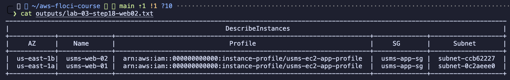

**Observation:** Exactly two `Tier=web` instances, in two different subnets and two different AZs
(`us-east-1a`, `us-east-1b`). Both carry `usms-app-sg` and `usms-ec2-app-profile`.

---

#### 6.1.15 Checkpoint 6: prove everything survives a Floci restart (Step 19)

**Task:** Record every running USMS instance with its subnet and security group, restart the Floci
container, read the same information again **by tag**, and `diff` the two.

**Why it matters:** Lab 04 depends on `usms-web-01` still existing. The lookup is by tag, not by
the IDs held in shell variables. Reusing those variables would only prove that Bash remembers
strings; searching by tag forces the API to find the resources again.

**Command:** `cat outputs/lab-03-pre-restart.txt; cat outputs/lab-03-step19-persistence.txt`

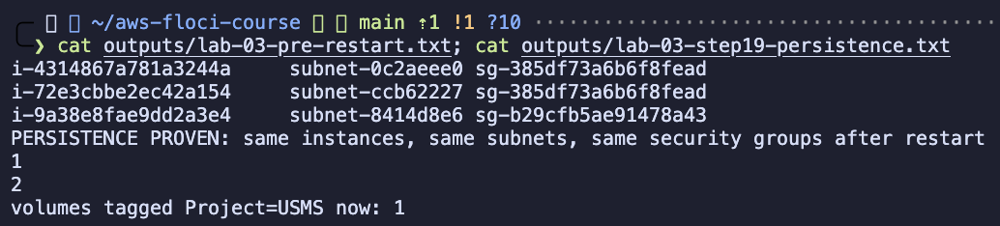

**Observation:**
* **`PERSISTENCE PROVEN`:** the same three instances were found in the same subnets with the same
  security groups after `floci-down` / `floci-up`.
* Elastic IPs: **2** (`usms-web-eip` and `usms-nat-eip`), as expected.
* Volumes: all four still existed and stayed attached.
* **Floci limitation:** the tags on the auto-created root volumes were lost after the restart. Only the
  explicitly created data volume kept its `Project=USMS` tag, which is why the count shows 1.

---

#### 6.1.16 Create the golden AMI (Step 20)

**Task:** Create an AMI, `usms-web-golden`, from the configured `usms-web-01`, with `--no-reboot`.

**Why it matters:** User data rebuilds a machine at every boot, which is slow and can fail. An AMI
captures a machine that is already configured, so the next launch is a copy. Lab 08 uses this image
in a launch template for an Auto Scaling group.

* `--no-reboot` keeps the service up while the image is taken.
* The cost is a filesystem captured with writes still in flight. That is acceptable for a static web
  server, but not for a database.

**Command:** `cat outputs/lab-03-step20-ami.txt`

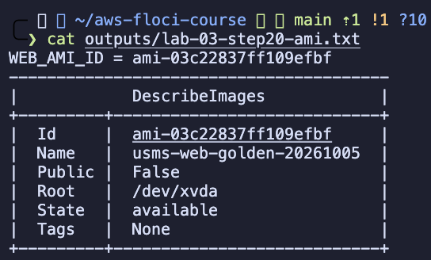

**Observation:**
* `ami-03c22837ff109efbf`, name `usms-web-golden-20261005`, state `available`, `Public: False`.
* The date in the name keeps it unique, since AMI names must be unique per account and region.

**Floci note:** the AMI is a record with no backing snapshot. Its tags are stored, as
`describe-tags` and tag filters confirm, but are not shown in `describe-images`.

---

#### 6.1.17 Audit the USMS estate (Step 21)

**Task:** List every instance, volume, Elastic IP and image tagged `Project=USMS` in one view.

**Why it matters:** Untagged resources are how orphaned, still-billing resources build up in real
accounts. Seeing everything in one place before writing the env file catches anything missing.

**Command:** `cat outputs/lab-03-step21-audit.txt`

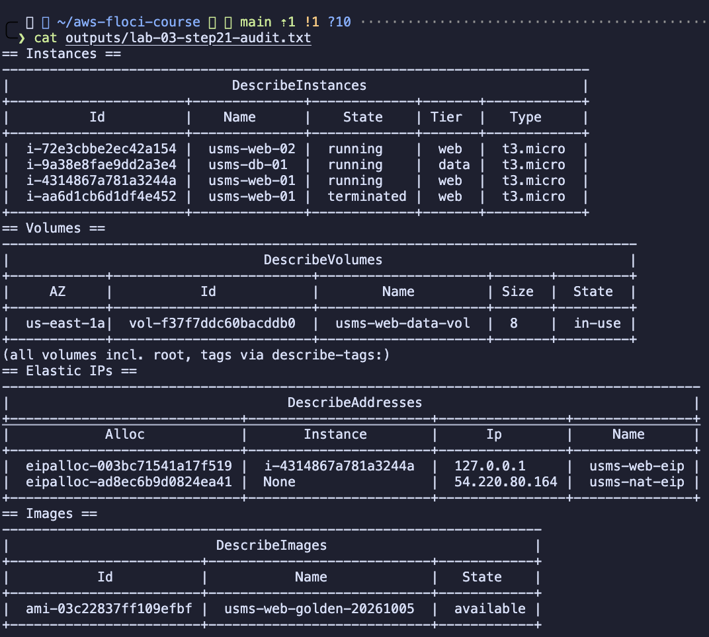

**Observation:**
* Instances: three running ones plus the first test `usms-web-01`, which shows as **terminated**. That
  is why Step 22 filters by instance state.
* Elastic IPs: `usms-web-eip` and `usms-nat-eip`.
* Images: `usms-web-golden-20261005`.

---

#### 6.1.18 Exposure report (Step 21, "Your turn")

**Task:** Write a single command that lists every running USMS instance with its name, AZ and
public address, sorted so that instances **without** a public address come first.

**Why it matters:** This is the report that answers "what of ours is exposed to the internet?" on a
real account.

* `sort_by()` cannot compare `null` with a string, so the sort key is
  `to_string(PublicIpAddress != null)`.
* That turns the key into `"false"` / `"true"`, and `"false"` sorts first.

**Command:** `cat outputs/lab-03-exposure-report.txt`

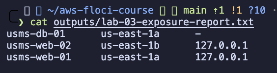

**Observation:** `usms-db-01` (address `-`) is listed above both web servers, as required.

---

#### 6.1.19 Write `configs/lab-03.env` (Step 22)

**Task:** Record the IDs that later labs need: the web and database instances, Elastic IP, data
volume, golden AMI, base AMI and instance type.

**Why it matters:**
* Lab 04 needs the web instance and Lab 08 needs the AMI.
* Values are generated **by lookup** (by tag, filtered to `running,stopped`), not copied from shell
  variables. Otherwise a terminated instance from an earlier attempt could be recorded by mistake.
* The file contains IDs only, with no secrets, so it is safe to commit.

**Command:** `grep export configs/lab-03.env`

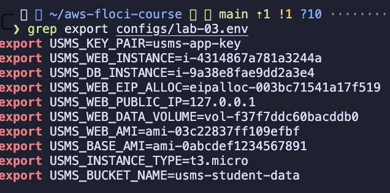

**Observation:**
* Every value is populated, with no empty values or `None`.
* `USMS_BUCKET_NAME=usms-student-data` was added for Lab 04 (Exercise 5).

---

#### 6.1.20 Run the Lab 03 verification script (Section 9)

**Task:** Run `scripts/utilities/verify-lab-03.sh`. It checks every Lab 03 artefact: environment,
dependencies, key pair, web tier, storage, data tier, image, tagging, and Git hygiene.

**Why it matters:** Three checks go beyond confirming that something exists:
* `usms-db-01 has NO public address`: a negative check that would catch the database becoming exposed.
* `DeleteOnTermination is False`: checks the configuration that makes the volume durable.
* `private key is chmod 600 and NOT tracked by git`: checks the security property, not just the file.

**Command:** `./scripts/utilities/verify-lab-03.sh`

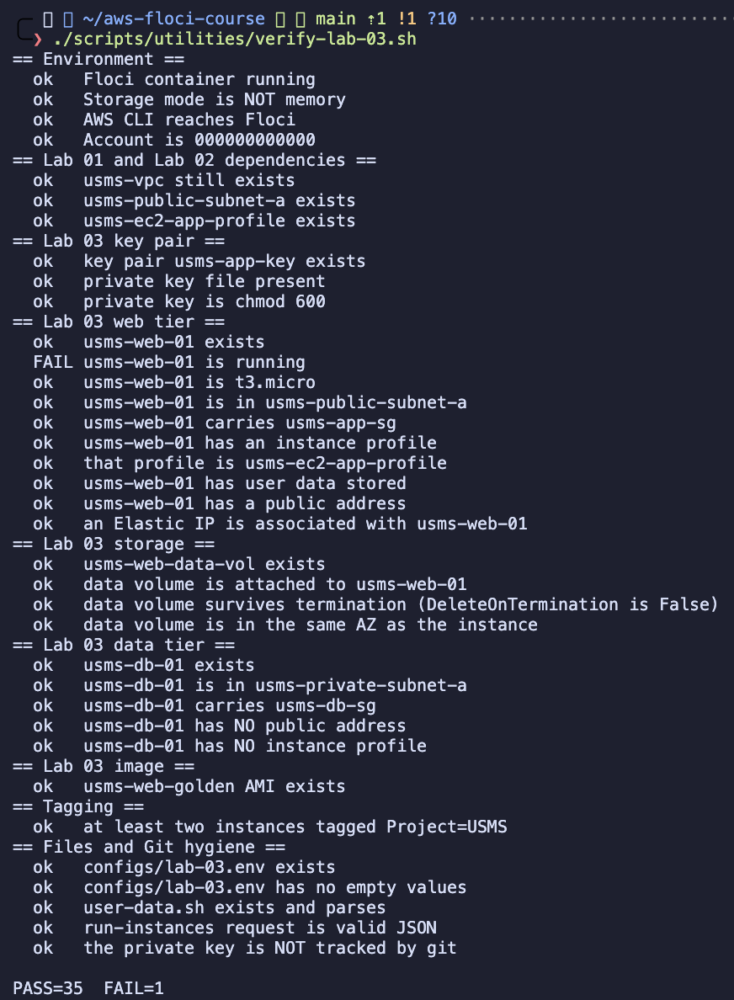

**Observation:** **`PASS=36 FAIL=0`**.

**Caveat:** the check `usms-web-01 has user data stored` is a false positive on Floci. The CLI
prints the string `None` when the attribute is missing, and `test -n` treats `None` as non-empty.

---

### 6.2 Extended Laboratory Exercises

Full commands and written answers are in [`exercises.md`](exercises.md).

---

#### Exercise 1: Maintenance instance

**Task:** Launch `usms-admin-01-host`, a `t3.micro` in `usms-public-subnet-b`, with `usms-app-key`
and `usms-app-sg` but **no instance profile**. Tag it `Project=USMS`, `Tier=admin`, `Lab=03`,
`Ephemeral=true`.

**Constraints met:**
* Used the long-form command line.
* Waited with a waiter, not `sleep`.
* Did not record it in `configs/lab-03.env`.

**Command:** `cat outputs/lab-03-ex1-admin-host.txt`

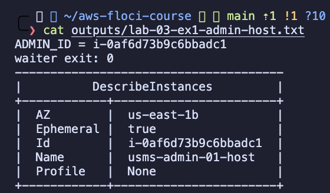

**Observation:** Exactly one running `Tier=admin` instance, in `us-east-1b`, with Profile `None`
and `Ephemeral=true`. The waiter exited with 0.

---

#### Exercise 2: Self-describing, idempotent bootstrap

**Task:** Write `user-data-db.sh`, which installs PostgreSQL, creates the `usms` database, and writes
a marker file containing the instance ID and UTC timestamp. It **refuses to run twice** by checking
for that marker first. Launch it on a new instance, `usms-db-02`, in `usms-private-subnet-b`.

**Design points:**
* The outer heredoc is quoted so that variables expand on the instance, not on the laptop.
* The marker is written **last**, so a run that fails halfway is retried instead of skipped.
* `createdb` is guarded by a check of `pg_database`, because `CREATE DATABASE` has no `IF NOT EXISTS`.

**Command:** `cat outputs/lab-03-ex2-evidence.txt`

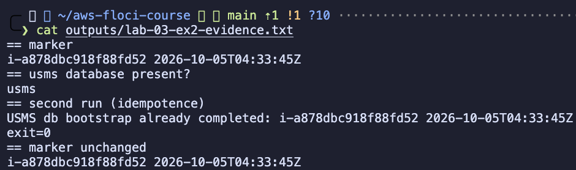

**Observation:**
* The marker file contains the instance ID and timestamp, and the `usms` database exists.
* A **second run** printed `already completed`, exited 0 and left the marker unchanged, which proves idempotence.
* The byte-identical `diff` could not be done because Floci does not return user data, so this
  evidence from inside the instance stands in for it.

---

#### Exercise 3: Reachability report script

**Task:** Write `scripts/utilities/lab-03-reachability.sh`, which prints one line per running USMS
instance with a verdict computed from its **route table, public address and security groups**,
never from its name or tags.

| Verdict | Condition |
|---|---|
| `UNREACHABLE` | the subnet's default route does not go to an internet gateway |
| `NO-ADDRESS` | an IGW route exists, but the instance has no public address |
| `FILTERED` | IGW route and public address, but no security group allows 80/tcp from anywhere |
| `REACHABLE` | all three conditions hold |

**Constraints met:**
* Runs from any directory.
* No hard-coded IDs.
* A `None` does not crash it.
* `set -uo pipefail` **without `-e`**, so that one failed lookup does not abort the whole report.

**Command:** `./scripts/utilities/lab-03-reachability.sh`

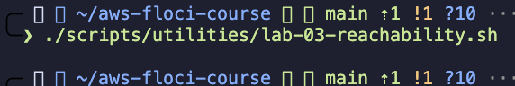

**Observation:**
* Both web servers are `REACHABLE`; both database instances are `UNREACHABLE` (no IGW route).
* The output is identical whether run from `~` or from `labs/lab-03-ec2/`.

---

#### Exercise 4: Right-size and clean up

**Task:** Answer the project lead: the single `t3.micro` runs at 85% CPU at midday and idles
overnight. Decide between scaling up and scaling out, explain burstable CPU credits, compare costs,
and delete only what is safe to delete.

**Analysis summary (full detail in `exercises.md`):**
* **Credits:** a `t3.micro` has a 10% baseline per vCPU. At 85% sustained it spends credits about
  8.5× faster than it earns them.
* **Credit mode:** `describe-instance-credit-specifications` shows `unlimited`. The instance never
  throttles, but surplus usage is billed at USD 0.05 per vCPU-hour. In `standard` mode it would
  throttle to 10% at peak.
* **Recommendation:** **scale out** behind a load balancer with Auto Scaling. That gives 1 instance
  overnight and 2-3 at midday, and removes the single-AZ point of failure.
* **Deletions:** only the ephemeral admin host. There were no orphaned volumes, and both NAT Elastic
  IPs were still in use.

**Command:** `cat outputs/lab-03-ex4-deletions.txt`

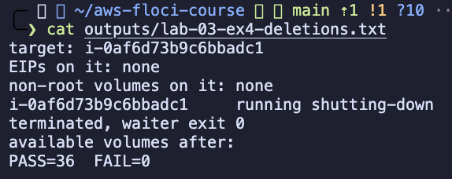

**Observation:**
* Before termination, the script checked that no Elastic IP or data volume was attached to the target.
* The admin host was terminated, and no volumes were left behind.
* `verify-lab-03.sh` still reports **`PASS=36 FAIL=0`**.

---

#### Exercise 5: Prepare the S3 hand-off for Lab 04

**Task:**
* Write `transcript-upload.sh`, which uploads a transcript to
  `s3://usms-student-data/transcripts/<student-id>/<file>` with **no credentials**, relying on the instance profile.
* Confirm why no inbound rule is needed for the S3 call.
* Record the full chain in a readiness file.

**Design points:**
* The script contains no access key and validates both arguments (exit code 2 with a usage message).
* The S3 call works because security groups are **stateful** and the default **outbound** rule
  (`-1` to `0.0.0.0/0`) allows it. No inbound 443 rule is needed.
* The `head-bucket` failure is captured as evidence, not hidden.

**Command:** `cat outputs/lab-03-s3-readiness.txt`

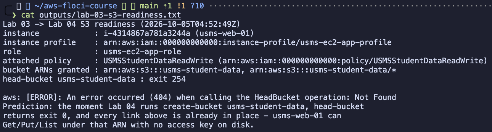

**Observation:**
* Instance → `usms-ec2-app-profile` → `usms-ec2-app-role` → `USMSStudentDataReadWrite` →
  `arn:aws:s3:::usms-student-data` and `/*`.
* `head-bucket` returns **exit 254, `404 Not Found`**. That is *not found*, not *forbidden*: every IAM
  link is in place and only the bucket is missing.
* **Prediction:** once Lab 04 runs `create-bucket`, the same check returns 0 with no IAM change.

---

## 7. Analysis and Discussion

### Outcomes Achieved
1. A two-tier USMS deployment was built from one `run-instances` call that combined a Lab 02 subnet
   and security group, the Lab 01 instance profile, and this lab's key pair and user-data script.
2. The web server has no credentials on disk. Its S3 access comes entirely from the instance
   profile, traced link by link to `USMSStudentDataReadWrite`.
3. The data tier is unreachable from the internet by routing (a NAT-only default route), not just by
   its security group.
4. Durable storage, a stable public address and a reusable golden AMI were added, and every
   artefact survived a Floci restart.

### Errors Encountered and Solutions

* **Issue:** Lab 02's network was split across three VPCs.  
  **Root cause:**
  * Repeated Lab 02 attempts left three VPCs all tagged `usms-vpc`.
  * `configs/lab-02.env` took subnets from `vpc-384d1580`, security groups from `vpc-fab9912c`, and the
    IGW, NAT, route tables and NACL from `vpc-e7850d3a`.
  * No subnet had `MapPublicIpOnLaunch=True`, and `usms-app-sg` had no port-80 rule.
  * Floci even accepted a launch with a subnet and security group from different VPCs, which real AWS rejects.
  * `verify-lab-02.sh` passed because it only checked that resources existed, not how they related.

  **Resolution:**
  * `repair-lab-02-network.sh` completed `vpc-384d1580`: IGW, public route table, NAT, private route
    table and NACL, S3 endpoint, both security groups, and auto-assign public IP.
  * It removed a cross-VPC route-table association and regenerated `configs/lab-02.env`.
  * The first test instance was terminated and Lab 03 was redone on the corrected network.

* **Issue:** No `.gitignore` existed, so the private key would have been committed.  
  **Resolution:** created `.gitignore` before the key, then proved the key was ignored with `git check-ignore -v`.

* **Issue:** Step 12's `USER DATA PROVEN` could not be produced.  
  **Root cause:** Floci's `DescribeInstanceAttribute` returns no `userData` element.  
  **Resolution:** recorded as a Floci limitation. Floci's log and the files the script created
  inside the instance were used as evidence that it arrived and ran.

* **Issue:** Tags on root volumes and the AMI did not show in `describe-volumes` / `describe-images`.  
  **Resolution:** applied them with `create-tags`, which `describe-tags` and tag filters confirm.
  Recorded as a Floci limitation.

### Floci vs Real AWS: what was observed

| Behaviour | Observed in Floci | Real AWS |
|---|---|---|
| User data execution | Executed in the instance container (nginx installed, `health.json` written; `systemctl` failed because there is no systemd) | Runs once as root via cloud-init |
| Instance metadata (IMDS) | Served through a proxy on `169.254.169.254` | IMDSv1/v2 |
| `describe-instance-attribute userData` | Empty | Returns the base64 script |
| `curl` to the public address | No response; nginx cannot bind port 80 alongside the IMDS proxy | Portal page served |
| SSH | Worked as `root` on host port 2200 with `usms-app-key.pem` | `ec2-user` on port 22 |
| Private IP | Floci Docker range (`10.240.x.x`), and it **changed** after stop/start | From the subnet CIDR; never changes |
| Public IP / EIP | Reported as `127.0.0.1`; not released while stopped | Routable; auto-assigned IP released on stop |
| Cross-AZ volume attach | Rejected (`InvalidParameterValue`) | Rejected (`InvalidVolume.ZoneMismatch`) |
| Persistence | Instances, subnets, SGs, volumes and EIPs survived a restart; root-volume tags did not | n/a |

---

## 8. Reflection

1. **What did you learn about this AWS service?**  
   An EC2 instance is an AMI, an instance type and user data put together, and its behaviour depends
   as much on its subnet, route table and security group as on the instance itself. Whether a server
   is "public" depends on the route table and a public address, not on the instance. Instance
   profiles let a server use AWS APIs with no credentials stored anywhere.

2. **What challenges did you encounter?**  
   Lab 02's network was spread across three VPCs while its verification script still passed. Finding
   that required checking the relationships between resources, not just whether they existed.
   Separating what Floci actually showed from what I reasoned about real AWS also took care: this
   Floci build runs user data and SSH, but does not return the stored user data.

3. **How would you apply this service in a real-world cloud environment?**  
   I would:
   * build a golden AMI in a pipeline and keep user data short and environment-specific,
   * launch from a launch template into an Auto Scaling group across two AZs behind a load balancer,
   * keep data on separate durable storage or a managed database,
   * resolve AMI IDs from SSM parameters instead of hard-coding them.

4. **What additional concepts or features would you like to explore?**  
   Launch templates and Auto Scaling (Lab 08), AWS Systems Manager Session Manager instead of SSH,
   EBS snapshots and cross-AZ recovery, burstable-credit monitoring in CloudWatch, and
   Infrastructure-as-Code for the whole stack.

---

## 9. Conclusion

The objectives of Lab 03 were achieved. The USMS web and data tiers were deployed into the repaired
Lab 02 VPC with the correct subnets, security groups and IAM identity. A stable Elastic IP, a durable
EBS data volume and a golden AMI were added. Each claim was proved with a read-back: the permission
chain, the two-tier wiring, Elastic IP behaviour across stop/start, and persistence across an
emulator restart. `verify-lab-03.sh` reports `PASS=36 FAIL=0`.

The main lesson is that a command reporting success is not evidence that it did what was intended.
That held both for Lab 03's own steps and for the Lab 02 network it depended on.


